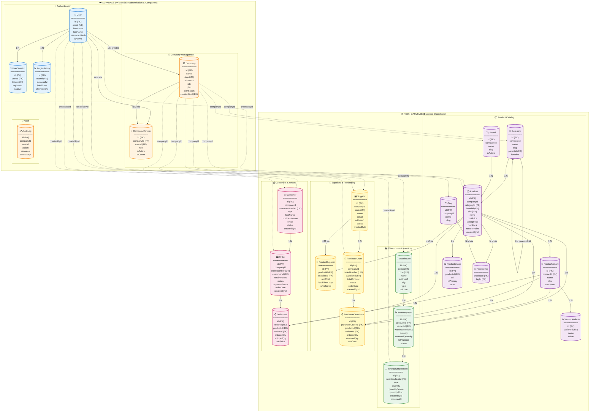

# 🗺️ INVISTA DATABASE - COMPLETE ENTITY RELATIONSHIP DIAGRAM

## NEW PROPER SCHEMA (V2) - ALL TABLES & RELATIONSHIPS

---

## FULL SYSTEM ARCHITECTURE



---

## DETAILED RELATIONSHIP MAP

### 🔐 **SUPABASE DATABASE**

#### User Relationships:

```
User (1) ──────> (N) UserSession
User (1) ──────> (N) LoginHistory
User (1) ──────> (N) Company [as creator]
User (N) ←────> (N) Company [via CompanyMember]
```

#### Company Relationships:

```
Company (N) ←──> (N) User [via CompanyMember]
Company (1) -.──> (N) [ALL NEON TABLES] [via string companyId]
```

---

### 🗄️ **NEON DATABASE**

#### Product Catalog:

```
Category (1) ──────> (N) Category [parent-child tree]
Category (1) ──────> (N) Product

Brand (1) ──────> (N) Product

Product (1) ──────> (N) ProductVariant
Product (1) ──────> (N) ProductImage
Product (N) ←──────> (N) Tag [via ProductTag]
Product (1) ──────> (N) InventoryItem
Product (N) ←──────> (N) Supplier [via ProductSupplier]

ProductVariant (1) ──> (N) VariantAttribute
ProductVariant (1) ──> (N) InventoryItem
```

#### Warehouse & Inventory:

```
Warehouse (1) ──────> (N) InventoryItem

InventoryItem relationships:
  - Product (1) ──> (N) InventoryItem
  - ProductVariant (1) ──> (N) InventoryItem [optional]
  - Warehouse (1) ──> (N) InventoryItem
  - InventoryItem (1) ──> (N) InventoryMovement
```

#### Purchasing:

```
Supplier (1) ──────> (N) PurchaseOrder
Supplier (N) ←──────> (N) Product [via ProductSupplier]

PurchaseOrder (1) ──> (N) PurchaseOrderItem

PurchaseOrderItem relationships:
  - Product (1) ──> (N) PurchaseOrderItem
  - ProductVariant (1) ──> (N) PurchaseOrderItem [optional]
```

#### Sales:

```
Customer (1) ──────> (N) Order

Order (1) ──────> (N) OrderItem

OrderItem relationships:
  - Product (1) ──> (N) OrderItem
  - ProductVariant (1) ──> (N) OrderItem [optional]
```

---

## CROSS-DATABASE RELATIONSHIPS

### String References (No FK Constraints):

```
SUPABASE.Company.id (UUID)
    └──> NEON.Category.companyId (String)
    └──> NEON.Brand.companyId (String)
    └──> NEON.Product.companyId (String)
    └──> NEON.Warehouse.companyId (String)
    └──> NEON.Supplier.companyId (String)
    └──> NEON.Customer.companyId (String)
    └──> NEON.PurchaseOrder.companyId (String)
    └──> NEON.Order.companyId (String)
    └──> NEON.Tag.companyId (String)

SUPABASE.User.id (UUID)
    └──> NEON.Product.createdById (String)
    └──> NEON.Supplier.createdById (String)
    └──> NEON.Customer.createdById (String)
    └──> NEON.PurchaseOrder.createdById (String)
    └──> NEON.Order.createdById (String)
    └──> NEON.InventoryMovement.createdById (String)
```

**NOTE:** These are string references only. Application-level validation required.

---

## CARDINALITY LEGEND

| Symbol       | Meaning                                  |
| ------------ | ---------------------------------------- |
| `─────>`     | One-to-Many (solid line = FK constraint) |
| `←────>`     | Many-to-Many (via junction table)        |
| `-.───>`     | Cross-database string reference (no FK)  |
| `(1)`        | One side                                 |
| `(N)`        | Many side                                |
| `[optional]` | Nullable foreign key                     |

---

## CASCADE BEHAVIORS

### OnDelete Behaviors:

**CASCADE:**

- User → UserSession (delete sessions when user deleted)
- Company → CompanyMember (remove memberships)
- Product → ProductVariant (delete variants)
- Product → ProductImage (delete images)
- Product → InventoryItem (delete inventory)
- Order → OrderItem (delete line items)
- PurchaseOrder → PurchaseOrderItem (delete line items)

**SET NULL:**

- Category → Product.categoryId
- Brand → Product.brandId

**RESTRICT:**

- Category parent → children (prevent delete if has children)
- Supplier → PurchaseOrder (can't delete supplier with orders)
- Customer → Order (can't delete customer with orders)
- Product → OrderItem (can't delete product in orders)

---

## KEY IMPROVEMENTS

✅ **Proper FK Relations:** Product → Category/Brand work!
✅ **No Orphaned Fields:** Every FK has a proper @relation
✅ **Junction Tables:** Many-to-many properly normalized
✅ **Company Scoping:** All business data includes companyId
✅ **Audit Trail:** createdById on all major tables
✅ **Clean Hierarchy:** Clear separation of concerns

---

## QUERY EXAMPLES

### Get Product with All Relations:

```typescript
const product = await neonClient.product.findUnique({
  where: { id: productId },
  include: {
    category: true, // ✅ Works!
    brand: true, // ✅ Works!
    variants: {
      include: {
        attributes: true,
      },
    },
    images: true,
    tags: {
      include: {
        tag: true,
      },
    },
    inventoryItems: {
      include: {
        warehouse: true,
      },
    },
  },
});
```

### Get Company with All Business Data:

```typescript
// 1. Get company from Supabase
const company = await supabaseClient.company.findUnique({
  where: { id: companyId },
});

// 2. Get business data from Neon
const products = await neonClient.product.findMany({
  where: { companyId: company.id },
});

const warehouses = await neonClient.warehouse.findMany({
  where: { companyId: company.id },
});
```

---

**This diagram shows the PROPER schema - ready to implement!**
